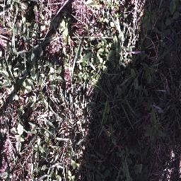
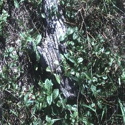

# Semi-Supervised Fine-Tuning on Out-of-Distribution Data

This project simulates a semi-supervised learning (SSL) workflow for computer vision models. It compares the performance of a static model with a self-updating model that adapts to new data.

**Key Idea:** Fine-tuning models with confident, pseudo-labeled data can recover lost accuracy in new environments without any human annotations.

---

## Use Case

You're deploying a plant classification model in the wild and a new camera, lighting condition, or location causes accuracy to drop. This repo shows how to:
- Fine-tune your model using unlabeled samples
- Maintain or even improve performance across data shifts
- Benchmark semi-supervised vs. static performance across multiple cycles

---

## Project Scope & Configuration Notes
This repo is intended as a prototype and stress test of a semi-supervised learning (SSL) pipeline under challenging conditions. It is not optimized for production accuracy or real-world deployment yet. The goal is to validate the learning mechanism, not to maximize absolute performance.

### Configuration Highlights
- The supervised model is trained using 100 samples per class, enforcing a uniform class distribution.
This deliberately ignores real-world class imbalance in order to:

    - Normalize the supervised signal across all species

    - Stress-test the model’s ability to generalize from limited data

- The test set used in simulation:

    - Comes from a different device (camera ID) than the training set

    - Uses the natural, unbalanced class distribution found in the real dataset

- SSL adaptation is based on:

    - A FixMatch-style pseudo-labeling loop

    - Confidence-based filtering

    - Weak/strong augmentations

    - Simulated domain shift (JPEG compression, blur, etc.)

**Takeaway:** This setup is intentionally harsh. It pushes the model to adapt across a domain boundary (camera difference + label imbalance) with no human-labeled support, only unlabeled data and confidence calibration.

### Why This Matters
Real-world deployments in agriculture, defense, and field robotics often face:
- Domain shifts between collection devices
- Unknown or evolving class distributions
- No reliable access to cloud retraining
This repo serves as a prototype for building self-adaptive, cloudless ML systems that can recover from domain shift using only local data.

 

*Example of an image in static model training set (left) and test data used for SSL (right).*

## Method Overview

The simulation follows these steps:
1. **Train base model (`WeedTuner`)** on one device's labeled data
2. **Simulate drift** by introducing new-device data with JPEG compression, blur, etc.
3. **Apply FixMatch-style SSL**: weak and strong augmentations + confidence filtering
4. **Accumulate fine-tuning set** with validated pseudo-labeled samples
5. **Run inference per cycle** and compare accuracy to the static model
6. **Visualize per-cycle performance trends**

---

## Results
The static model is trained for 20 epochs, yielding a training and validation accuracy of around 86%.

The table below shows accuracy on new-device test data over 5 simulation runs, comparing the static model with the self-adapting model updated via semi-supervised fine-tuning.

| Run        | Fine-Tuned Accuracy % | Static Accuracy % |
| ---------- | ------------------- | --------------- |
| 1          | 57.6               | 52.3           |
| 2          | 58.0               | 53.8           |
| 3          | 49.5               | 49.0           |
| 4          | 52.8               | 51.9           |
| 5          | 57.6               | 53.3           |
| **Avg**    | **55.1**           | **52.1**       |

**Per-Cycle Accuracy Trends**  


---

## How to Run
This project is designed to run in a fully reproducible environment using Docker with GPU support (CUDA 11.2, cuDNN 8).

### Build the Environment
```bash
docker-compose build
```

### Run the Container
```bash
docker-compose up -d
```

### Run the Simulation
```bash
docker exec -it deep_weeds bash
python main.py
```

This will:
- Fine-tune a MobileNetV2 model on labeled plant data from one camera device

- Run a 30-cycle semi-supervised simulation on out-of-distribution images from another device

- Output a per-cycle comparison of static vs. adaptive model accuracy

Plot will be saved to: /workspace/accuracy_per_cycle.png
